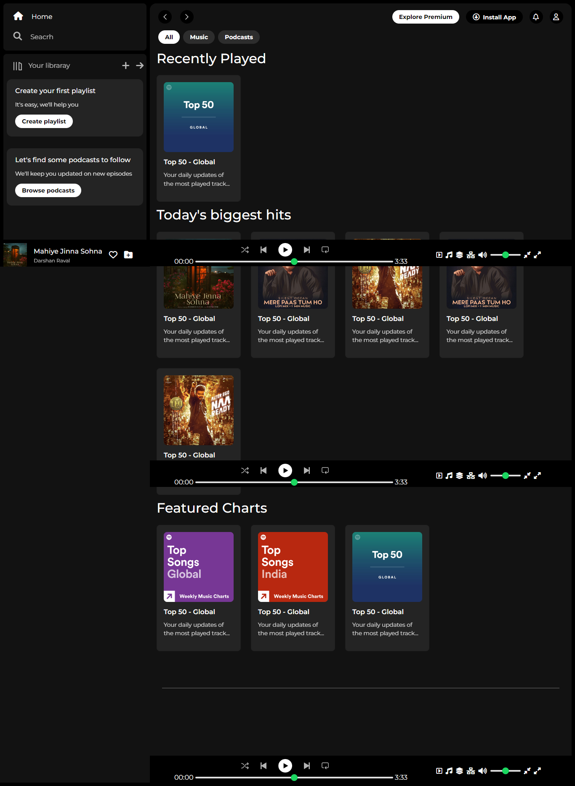

<h1>Spotify Web Player Clone</h1>

A simple front-end clone of the Spotify web player designed using HTML and CSS. This project aims to replicate the user interface of the Spotify web player.

<h2>Features</h2>
<ul>
  <li><b>Responsive Design:</b> Optimized for both desktop and mobile devices.</li>
  <li><b>Navigation Bar:</b> Includes links to Home, Search, and Your Library.</li>
  <li><b>Content Sections:</b> Features sections for playlists, albums, and more.</li>
  <li><b>Footer Player:</b> Mimics Spotify's music player controls.
</li>
</ul>

<h2>Demo</h2>

Link to demo

<h2>Installation</h2>
Clone the repository:

bash
Copy code
git clone https://github.com/yourusername/spotify-web-player-clone.git
cd spotify-web-player-clone
Open the project:
Simply open the index.html file in your preferred web browser to view the project.

<h2>Usage</h2>
Navigation: Use the navigation bar to switch between different sections.
Content Interaction: Explore the different playlists and albums displayed.
Technologies Used
HTML5: Markup language for structuring the web page.
CSS3: Styling the web page to replicate Spotify's look and feel.
Contributing
Contributions are welcome! Please follow these steps to contribute:

<h2>Fork the repository.</h2>
Create a new branch (git checkout -b feature/your-feature-name).
Commit your changes (git commit -m 'Add some feature').
Push to the branch (git push origin feature/your-feature-name).
Open a Pull Request.
Please make sure your code follows the project's coding standards.

<h2>License</h2>
This project is licensed under the MIT License. See the LICENSE file for more details.

<h2>Acknowledgements</h2>
Spotify for the inspiration.
Font Awesome for icons used in the project.
<h2>Contact</h2>
If you have any questions, feel free to reach out:

Email: akash703315@gmail.com
GitHub: Its-Verma
